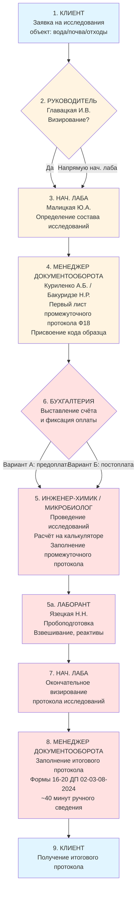
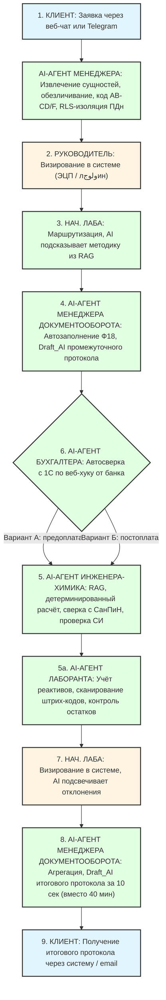

# 📋 ДОКУМЕНТ 1: ПРОТОКОЛ ВСТРЕЧИ С ОТВЕТСТВЕННЫМИ ЛИЦАМИ ООО «ДИЛАБ»

**Дата проведения:** 02 сентября 2026 г.  
**Место:** г. Краснодар, ул. им. Селезнева, 204, офис 42  
**Протокол составил:** Абрамов Андрей Васильевич, AI-архитектор / системный аналитик, ООО «Автостар Плюс»  
**Дата рассылки:** 06.09.2026  
**Следующая встреча:** 09.09.2026, 10:00 (обсуждение открытых вопросов и согласование Доп. соглашения №1)

---

## 👥 Участники встречи

| №   | Роль                                       | ФИО            | Компания / Отдел    | Формат участия |
| --- | ------------------------------------------ | -------------- | ------------------- | -------------- |
| 1   | Генеральный директор                       | Главацкая И.В. | ООО «ДиЛаб»         | Очно           |
| 2   | Руководитель лаборатории                   | Малицкая Ю.А.  | ООО «ДиЛаб»         | Очно           |
| 3   | Зам. руководителя лаборатории              | Кочкина Л.И.   | ООО «ДиЛаб»         | Очно           |
| 4   | Менеджер документооборота                  | Куриленко А.Б. | ООО «ДиЛаб»         | Очно           |
| 5   | Менеджер документооборота                  | Бакуридзе Н.Р. | ООО «ДиЛаб»         | Очно           |
| 6   | Инженер-химик                              | Азарова Ю.М.   | ООО «ДиЛаб»         | Очно           |
| 7   | Инженер-химик                              | Махоткина Д.А. | ООО «ДиЛаб»         | Очно           |
| 8   | Микробиолог                                | Жусупова М.Т.  | ООО «ДиЛаб»         | Очно           |
| 9   | Микробиолог                                | Рунец Т.В.     | ООО «ДиЛаб»         | Очно           |
| 10  | Лаборант                                   | Язецкая Н.Н.   | ООО «ДиЛаб»         | Очно           |
| 11  | Представитель Бухгалтерии                  | отсутстует     | ООО «ДиЛаб»         | отсутстует     |
| 12  | Представитель СМК / Специалист по качеству | отсутствует    | ООО «ДиЛаб»         | отсутстует     |
| 13  | AI-архитектор / СА (Исполнитель)           | Абрамов А.В.   | ООО «Автостар Плюс» | Очно           |

---

## 🎯 Цель встречи

1. Детализировать производственный цикл лаборатории от поступления заявки клиента до выдачи итогового протокола.
2. Зафиксировать **9-шаговую модель AS-IS** с выявлением узких мест и болей.
3. Согласовать **модель TO-BE** с внедрением AI-агентов и RAG-базы знаний.
4. Актуализировать список стейкхолдеров (11 ролей по Договору) и выявить недостающих участников производственного цикла.
5. Зафиксировать требования к RAG-базе знаний для борьбы с ручным поиском СанПиН / ГОСТ / ПНД Ф / внутренних ДП.

---

## 📊 МОДЕЛЬ AS-IS: 9-шаговый производственный цикл

> _Зафиксировано по результатам интервью с руководителем лаборатории и менеджерами документооборота._

|  Шаг   | Участник                                                        | Действие                                                                                                             | Носитель                 | Боль / Риск                                                                                |
| :----: | --------------------------------------------------------------- | -------------------------------------------------------------------------------------------------------------------- | ------------------------ | ------------------------------------------------------------------------------------------ |
| **1**  | **Клиент**                                                      | Пишет заявку на проведение исследований (объект: проба воды / почвы / отходов)                                       | Бумага / email / телефон | Нет единой формы заявки; часть данных теряется                                             |
| **2**  | **Руководитель (Главацкая И.В.)**                               | Визирует заявку на имя Нач. лаба                                                                                     | Бумага                   | Загруженность руководства операционкой; риск потери заявки                                 |
| **3**  | **Нач. лаба (Малицкая Ю.А.)**                                   | Принимает заявку, определяет состав исследований                                                                     | Бумага                   | Ручная маршрутизация; риск ошибки в выборе методики                                        |
| **4**  | **Менеджер документооборота (Куриленко А.Б. / Бакуридзе Н.Р.)** | Заполняет первый лист промежуточного протокола (Ф 18 ДП 02-03-08-2024), присваивает код образца                      | Бумага                   | Ручное обезличивание; риск раскрытия ПДн клиента (§4.1.2 ГОСТ 17025)                       |
| **5**  | **Инженер-химик / Микробиолог**                                 | Проводит исследования, заполняет последующие листы промежуточного протокола, рассчитывает показатели на калькуляторе | Бумага + Excel           | **Ручной пересчёт → риск ошибки**; ручной поиск актуального СанПиН / ПНД Ф                 |
| **5а** | **Лаборант (Язецкая Н.Н.)**                                     | Пробоподготовка, взвешивание, приготовление реактивов                                                                | Бумажный журнал          | Ручной учёт реактивов; риск «минуса на складе»                                             |
| **6**  | **Бухгалтерия**                                                 | Выставляет счёт на оплату, фиксирует поступление оплаты                                                              | 1С:Бухгалтерия           | **Вариативность:** иногда этап идёт ДО лаборатории (предоплата), иногда ПОСЛЕ (постоплата) |
| **7**  | **Нач. лаба (Малицкая Ю.А.)**                                   | Окончательное визирование протокола исследований                                                                     | Бумага                   | Ручная сверка с нормативами; риск пропуска устаревшей редакции НД                          |
| **8**  | **Менеджер документооборота**                                   | На основе промежуточного протокола заполняет итоговый протокол испытаний (Формы 16–20 ДП 02-03-08-2024)              | Бумага + Word            | **40 минут** ручного сведения 3–5 промежуточных протоколов                                 |
| **9**  | **Клиент**                                                      | Получает итоговый протокол                                                                                           | Бумага / email           | Задержка выдачи; риск потери бумажной копии                                                |

### ⚠️ Ключевая вариативность процесса (этап 6)

В зависимости от типа договора с клиентом:

- **Вариант А (предоплата):** Заявка → Визирование → Бухгалтерия (счёт) → Оплата → Лаборатория → Протокол → Клиент
- **Вариант Б (постоплата):** Заявка → Визирование → Лаборатория → Протокол → Бухгалтерия (счёт) → Оплата → Клиент

AI-система должна поддерживать **оба сценария** без ручной перенастройки маршрута.

---

## 🟢 СОГЛАСОВАННЫЕ ФАКТЫ (подтверждены на встрече)

| №   | Факт                                                                                                                               | Источник / Подтверждение         |
| --- | ---------------------------------------------------------------------------------------------------------------------------------- | -------------------------------- |
| 1   | Лаборатория аккредитована (аттестат РОСС RU.0001.518520), работает по ГОСТ ISO/IEC 17025-2019                                      | Аттестат, РК 01-01-05-2022       |
| 2   | Объекты исследований: пробы воды (питьевая, природная, сточная и др.), почвы, отходы                                               | Область аккредитации             |
| 3   | Основной процесс: Заявка → Визирование → Промежуточный протокол → Итоговый протокол → Клиент                                       | ДП 02-03-08-2024 §8.2.7, §8.3.3  |
| 4   | Каждая поступившая проба обезличивается, на неё клеится этикетка с кодом образца                                                   | ДП 02-03-08-2024 §8.2.7          |
| 5   | Первый лист промежуточного протокола заполняет Менеджер документооборота (Ф 18 ДП 02-03-08-2024)                                   | ДП 02-03-08-2024 §8.2.7          |
| 6   | Первичные данные фиксируются в промежуточный протокол, расчёт — на рабочих местах                                                  | ДП 02-03-08-2024 §8.3.2          |
| 7   | Проверка расчётов — обязательна («просчёт показателей на калькуляторе»)                                                            | ДП 02-05-06-2022 Приложение 1    |
| 8   | Промежуточный протокол передаётся Менеджеру документооборота для заполнения итогового протокола                                    | ДП 02-03-08-2024 §8.3.3          |
| 9   | Протокол считается оконченным после фразы «Конец протокола испытаний»                                                              | ДП 02-03-08-2024 §8.3.3          |
| 10  | Ведётся Журнал учёта несоответствий, корректирующих и предупреждающих действий                                                     | ДП 02-03-08-2024 §8.3.2          |
| 11  | Согласована концепция: ИИ-агент формирует **черновик (Draft_AI)**, проведение только после валидации человеком (Human-in-the-loop) | По аналогии с КБМ                |
| 12  | Бюджет проекта ориентировочно ~7 562 000 ₽ без НДС, срок — ~28 недель                                                              | Предварительная договорённость   |
| 13  | В работе задействованы 11 ролей (включая Бухгалтера, Специалиста по качеству / СМК, IT-администратора)                             | Согласованный список по Договору |

---

## 🔴 БОЛИ И РИСКИ (красные флаги)

| №        | Боль / Риск                                                                  | Влияние                                                                                            | Предлагаемое решение (TO-BE)                                                                                                              |
| -------- | ---------------------------------------------------------------------------- | -------------------------------------------------------------------------------------------------- | ----------------------------------------------------------------------------------------------------------------------------------------- |
| **R-01** | **Весь документооборот на бумаге** (9 шагов)                                 | Риск потери, порчи, задержки выдачи протокола; невозможность быстрого поиска                       | Переход на цифровой документооборот с Draft_AI; бумажный носитель — только как резервная копия                                            |
| **R-02** | **Ручной поиск и сверка с СанПиН / ГОСТ / ПНД Ф / внутренними ДП**           | Много времени тратится аналитиками; риск использования устаревшей редакции НД; человеческий фактор | **RAG-база знаний** (ChromaDB) с актуальными НД; AI автоматически подтягивает нужный СанПиН / ПНД Ф к конкретной пробе и подсвечивает ПДК |
| **R-03** | **Ручной пересчёт показателей на калькуляторе**                              | Риск арифметической ошибки; риск потери аккредитации при аудите                                    | **Детерминированный движок** (Python/SQL) по верифицированным формулам из ПНД Ф; LLM не участвует в расчётах                              |
| **R-04** | **Прямое обращение клиента к Руководителю / Нач. лаба**                      | Загруженность руководства операционкой; нет единого окна регистрации                               | AI-агент **Менеджера по работе с клиентами** как единая точка входа; автоматическая маршрутизация                                         |
| **R-05** | **Ручное обезличивание проб** (присвоение кода AB-CD/F)                      | Риск случайного раскрытия ПДн клиента аналитикам; нарушение §4.1.2 ГОСТ 17025                      | Автоматическая генерация кода + RLS-изоляция ПДн в отдельной таблице                                                                      |
| **R-06** | **Ручное сведение 3–5 промежуточных протоколов в итоговый** (40 минут)       | Задержка выдачи протокола; риск опечаток в единицах измерения                                      | AI-агент формирует **Draft_AI итогового протокола за 10 секунд**                                                                          |
| **R-07** | **Вариативность этапа оплаты** (до / после лаборатории)                      | Риск путаницы в маршруте; риск выдачи протокола неоплаченному клиенту                              | AI поддерживает оба сценария; автоматическая сверка с 1С:Бухгалтерия по веб-хуку от банка                                                 |
| **R-08** | **Отсутствие единого реестра оборудования / реактивов / СО** в цифровом виде | Риск использования просроченных реактивов или СО с истёкшей поверкой                               | AI-агент автоматически проверяет срок поверки СИ и срок годности СО перед началом анализа; блокировка при нарушении                       |
| **R-09** | **Ручное ведение ВЛК, ПК/МСИ, внутренних аудитов**                           | Риск пропуска сроков; риск потери аккредитации                                                     | Модуль СМК с автоматическими напоминаниями; дашборд для Руководителя                                                                      |

---

## 🟢 МОДЕЛЬ TO-BE: Как будет работать с AI-агентами

### Ключевые изменения

| Процесс                 | БЫЛО (AS IS)                               | СТАЛО (TO BE)                                                        | Эффект                                                |
| ----------------------- | ------------------------------------------ | -------------------------------------------------------------------- | ----------------------------------------------------- |
| Приём заявки            | Клиент пишет Руководителю / Нач. лаба      | Клиент пишет AI-агенту Менеджера по работе с клиентами (единое окно) | -80% времени на приём; разгрузка руководства          |
| Обезличивание пробы     | Ручное присвоение кода, риск раскрытия ПДн | Автоматическая генерация кода + RLS-изоляция ПДн                     | 100% беспристрастие (§4.1.2)                          |
| Расчёт показателей      | Ручной пересчёт на калькуляторе            | Детерминированный движок по формулам из ПНД Ф                        | 0% ошибок расчёта                                     |
| Поиск нормативов        | Ручной поиск в папках с СанПиН / ГОСТ      | RAG-база знаний с автоподстановкой нужного НД                        | -90% времени на поиск; исключение устаревших редакций |
| Итоговый протокол       | 40 мин ручного сведения 3–5 промежуточных  | AI-агент за 10 с формирует Draft_AI                                  | -87% времени                                          |
| Визирование Нач. лаба   | Бумажная подпись, скан, email              | ЭЦП в системе, маршрут согласования                                  | -90% времени                                          |
| Контроль реактивов / СО | Ручной учёт в журналах                     | AI автоматически проверяет сроки, блокирует нарушения                | 100% контроль                                         |
| ВЛК / ПК / МСИ          | Ручное планирование в Excel                | Модуль СМК с автоматическими напоминаниями                           | 0% пропущенных сроков                                 |

---

## 🟡 ВОПРОСЫ НА УТОЧНЕНИЕ (выносятся в Доп. соглашение №1)

| №    | Вопрос                                                                                                                                | Ответственный за ответ       |
| ---- | ------------------------------------------------------------------------------------------------------------------------------------- | ---------------------------- |
| Y-01 | Используется ли LIMS или вся работа ведётся в Excel + Word + бумага?                                                                  | Руководитель лаборатории     |
| Y-02 | Как именно сейчас фиксируется факт оплаты? Нужна ли автоматическая сверка с 1С:Бухгалтерия по веб-хуку от банка?                      | Бухгалтерия                  |
| Y-03 | Кто именно отвечает за загрузку новых редакций СанПиН / ГОСТ / ПНД Ф в систему? Специалист по качеству или Менеджер документооборота? | Специалист по качеству / СМК |
| Y-04 | Как часто встречаются смешанные заявки (вода + почва + отходы), требующие участия и химика, и микробиолога одновременно?              | Менеджер документооборота    |
| Y-05 | Какой LLM-провайдер допустим для продакшена (Qwen, YandexGPT, GigaChat)? Есть ли ограничения по хранению данных за пределами РФ?      | IT-администратор             |
| Y-06 | Нужен ли Telegram-бот для лаборантов в «грязных» зонах (где неудобно печатать)?                                                       | Руководитель лаборатории     |
| Y-07 | Шкала скидок и полномочия согласования договоров с клиентами?                                                                         | Генеральный директор         |
| Y-08 | Формат и источники нормативных документов для RAG (есть ли электронные версии всех ПНД Ф, или часть только на бумаге)?                | Специалист по качеству       |
| Y-09 | Порядок инвентаризации образцов и реактивов на старт MVP?                                                                             | Лаборант                     |
| Y-10 | Требования к хранению персональных данных заказчиков (152-ФЗ)? Где физически размещать серверы?                                       | IT-администратор             |
| Y-11 | **Уточнить ФИО представителя Бухгалтерии и Специалиста по качеству / СМК** для включения в список стейкхолдеров                       | Генеральный директор         |

---

## 🔴 ПРОТИВОРЕЧИЯ И РИСКИ (требуют отдельного обсуждения)

| №        | Риск / Противоречие                                                                                                                                 | Влияние  | Предлагаемое решение                                                                                                                                |
| -------- | --------------------------------------------------------------------------------------------------------------------------------------------------- | -------- | --------------------------------------------------------------------------------------------------------------------------------------------------- |
| **C-01** | **Конфликт регуляторики и автоматизации:** ГОСТ 17025 требует, чтобы подписант протокола лично отвечал за результаты. ИИ не может быть подписантом. | Критично | ИИ формирует только Draft_AI. Финальная подпись — всегда человеком через ЭЦП. В протоколе — пометка «Черновик подготовлен с помощью ИИ»             |
| **C-02** | **Обезличивание проб vs работа ИИ:** ИИ-агент не должен видеть связь код образца ↔ заказчик (принцип беспристрастности, §4.1.2)                     | Критично | RLS + отдельный контур: ИИ работает только с кодами, персональные данные — в изолированной БД, доступной только Менеджеру по работе с клиентами     |
| **C-03** | **Риск галлюцинаций при расчётах:** LLM может ошибиться в формулах, что недопустимо для аккредитованной лаборатории                                 | Критично | Расчёты — не через LLM, а через детерминированный движок (Python/SQL) по верифицированным формулам из методик. LLM только извлекает исходные данные |
| **C-04** | **Сопротивление персонала:** Аналитики могут саботировать систему, т.к. она снижает их «независимость»                                              | Средний  | Вовлечение ключевых сотрудников (Малицкая, Кочкина) в приёмку MVP, обучение ≤ 2 часов                                                               |
| **C-05** | **Конфликт сроков:** Менеджер хочет «быстро», Руководитель — «с двойной проверкой»                                                                  | Средний  | Фиксация SLA в Доп. соглашении: черновик ≤ 10 с, валидация ≤ 15 мин                                                                                 |
| **C-06** | **Зависимость от внешних нормативов:** СанПиН и ГОСТ обновляются, RAG-база может устареть                                                           | Средний  | Регламент актуализации БЗ: раз в квартал + триггер на выход новых НД. Ответственный — Специалист по качеству                                        |
| **C-07** | **Отсутствие цифровых версий части ПНД Ф:** Некоторые методики есть только в бумажном виде                                                          | Средний  | Фаза 2 (RAG) включает оцифровку ключевых ПНД Ф; для бумажных — ручной ввод с верификацией                                                           |

---

## 🏗️ КЛЮЧЕВЫЕ АРХИТЕКТУРНЫЕ РЕШЕНИЯ (зафиксированы)

1. **Собственная БД PostgreSQL** — основной источник данных для всех 11 ролей.
2. **1С:Бухгалтерия** — только для бухгалтера; интеграция через REST API (счета, акты, выписки).
3. **ИИ-агенты на базе Qwen с RAG по ChromaDB** — запрет ответов «из головы».
4. **Детерминированный движок расчётов** (Python/SQL) — LLM не участвует в математике.
5. **Все документы — черновики (Draft_AI)**; проведение только после подтверждения пользователем (Human-in-the-loop).
6. **RLS (Record Level Security)** + полный аудит действий, хранение 1 год.
7. **Секреты** — только Docker Secrets / .env.
8. **Принцип беспристрастности (§4.1.2)** — ИИ работает только с кодами образцов, ПДн изолированы.
9. **Автоматическая актуализация RAG-базы** при выходе новых СанПиН / ГОСТ / ПНД Ф (регламент — 3 дня после публикации).

---

# 📎 ПРИЛОЖЕНИЯ К ПРОТОКОЛУ ВСТРЕЧИ ОТ 06.09.2026

---

## 📎 ПРИЛОЖЕНИЕ 1

**к Протоколу встречи от 01.09.2026**

### Схема производственного цикла AS-IS (9 шагов + ветвление по оплате)

### 🔴 Ключевые боли AS-IS (красные зоны на схеме)

| Шаг          | Боль                                         | Влияние                                                    |
| ------------ | -------------------------------------------- | ---------------------------------------------------------- |
| **1-3**      | Заявка идёт через Руководителя / Нач. лаба   | Загруженность руководства операционкой; риск потери заявки |
| **4**        | Ручное обезличивание проб                    | Риск раскрытия ПДн клиента (§4.1.2 ГОСТ 17025)             |
| **5**        | Ручной пересчёт на калькуляторе              | Риск арифметической ошибки; риск потери аккредитации       |
| **5**        | Ручной поиск СанПиН / ГОСТ / ПНД Ф           | Много времени; риск использования устаревшей редакции      |
| **6**        | Вариативность оплаты (до/после лаборатории)  | Риск путаницы в маршруте                                   |
| **7-8**      | Ручное сведение 3-5 промежуточных протоколов | 40 минут; риск опечаток в единицах измерения               |
| **Все шаги** | Бумажный документооборот                     | Риск потери, порчи, задержки выдачи                        |

---

## 📎 ПРИЛОЖЕНИЕ 2

**к Протоколу встречи от 01.09.2026**

### Схема производственного цикла TO-BE (с AI-агентами)

### 🟢 Ключевые улучшения TO-BE (зелёные зоны на схеме)

| Шаг          | Улучшение                                 | Эффект                                                   |
| ------------ | ----------------------------------------- | -------------------------------------------------------- |
| **1**        | Единое окно (AI-агент Менеджера)          | -80% времени на приём; разгрузка руководства             |
| **2-3**      | Визирование в системе (ЭЦП)               | -90% времени; полная прослеживаемость                    |
| **4**        | Автоматическое обезличивание              | 100% беспристрастие (§4.1.2 ГОСТ 17025)                  |
| **5**        | Детерминированный движок расчётов         | 0% ошибок расчёта; автоматическая сверка с СанПиН        |
| **5**        | RAG-база знаний                           | -90% времени на поиск НД; исключение устаревших редакций |
| **6**        | Автоматическая сверка с 1С                | 0% риска путаницы; поддержка обоих сценариев             |
| **7-8**      | AI формирует Draft_AI итогового протокола | -87% времени (40 мин → 10 сек)                           |
| **Все шаги** | Цифровой документооборот                  | 0% риска потери; мгновенный поиск                        |

---

## 📎 ПРИЛОЖЕНИЕ 3

**к Протоколу встречи от 01.09.2026**

### Реестр нормативных документов для RAG-базы

#### А. Внешние нормативные документы (СанПиН, ГОСТ, ПНД Ф)

| №   | Обозначение                     | Наименование                                                                                                        | Область применения                                                | Приоритет для RAG |
| --- | ------------------------------- | ------------------------------------------------------------------------------------------------------------------- | ----------------------------------------------------------------- | ----------------- |
| 1   | **ГОСТ ISO/IEC 17025-2019**     | Общие требования к компетентности испытательных и калибровочных лабораторий                                         | Базовый стандарт аккредитации; принцип беспристрастности (§4.1.2) | 🔴 Критичный      |
| 2   | **СанПиН 2.1.4.1074-01**        | Питьевая вода. Гигиенические требования к качеству воды централизованных систем питьевого водоснабжения             | Нормативы для проб воды (ПДК)                                     | 🔴 Критичный      |
| 3   | **СанПиН 2.1.7.1287-03**        | Санитарно-эпидемиологические требования к качеству почвы                                                            | Нормативы для проб почвы                                          | 🔴 Критичный      |
| 4   | **ПНД Ф 14.1:2:4.262-10**       | Методика измерений pH вод                                                                                           | Методика для проб воды                                            | 🟡 Высокий        |
| 5   | **ПНД Ф 14.1:2:3:4.245-2007**   | Методика измерений жёсткости воды                                                                                   | Методика для проб воды                                            | 🟡 Высокий        |
| 6   | **ПНД Ф 14.1:2:4.4-95**         | Методика измерений нитратов в воде                                                                                  | Методика для проб воды                                            | 🟡 Высокий        |
| 7   | **ПНД Ф 14.1:2:3.96-97**        | Методика измерений хлоридов в воде                                                                                  | Методика для проб воды                                            | 🟡 Высокий        |
| 8   | **ПНД Ф 14.1:2.159-2000**       | Методика измерений сульфатов в воде                                                                                 | Методика для проб воды                                            | 🟡 Высокий        |
| 9   | **ПНД Ф 14.1:2:4.168-2000**     | Методика измерений нефтепродуктов в воде                                                                            | Методика для проб воды                                            | 🟡 Высокий        |
| 10  | **ГОСТ 17.4.3.01-2017**         | Охрана природы. Почвы. Общие требования к отбору проб                                                               | Отбор проб почвы                                                  | 🟡 Высокий        |
| 11  | **ГОСТ 17.4.4.02-2017**         | Охрана природы. Почвы. Методы отбора и подготовки проб для химического, бактериологического, биологического анализа | Отбор проб почвы                                                  | 🟡 Высокий        |
| 12  | **ПНД Ф 12.4.2.1-99**           | Методика отбора проб отходов                                                                                        | Отбор проб отходов                                                | 🟡 Высокий        |
| 13  | **ПНД Ф 12.1:2:2.2:2.3:3.2-03** | Методика отбора проб отходов                                                                                        | Отбор проб отходов                                                | 🟡 Высокий        |
| 14  | **ГОСТ Р ИСО 31000**            | Менеджмент риска. Принципы и руководящие указания                                                                   | Управление рисками (СМК)                                          | 🟢 Средний        |
| 15  | **ГОСТ Р 58771**                | Менеджмент риска. Технологии оценки риска                                                                           | Управление рисками (СМК)                                          | 🟢 Средний        |
| 16  | **ГОСТ Р 51901.23**             | Менеджмент риска. Реестр риска. Руководство по оценке риска                                                         | Управление рисками (СМК)                                          | 🟢 Средний        |

_Примечание: Полный реестр ПНД Ф, ГОСТ, СанПиН, входящих в область аккредитации (аттестат РОСС RU.0001.518520), будет уточнён в Фазе 2 (MVP) совместно со Специалистом по качеству / СМК._

#### Б. Внутренние документированные процедуры (ДП) ООО «ДиЛаб»

| №   | Обозначение                  | Наименование                                                               | Область применения                                                                              | Приоритет для RAG |
| --- | ---------------------------- | -------------------------------------------------------------------------- | ----------------------------------------------------------------------------------------------- | ----------------- |
| 1   | **ДП 02-03-08-2024**         | Управление документацией системы менеджмента качества                      | Формы протоколов (Ф18, Ф16-20); журналы; порядок заполнения промежуточных и итоговых протоколов | 🔴 Критичный      |
| 2   | **ДП 02-05-06-2022**         | Выбор, верификация и валидация методик                                     | Формулы расчётов; проверка расчётов на калькуляторе (Приложение 1)                              | 🔴 Критичный      |
| 3   | **ДП 02-06-06-2022**         | Внутрилабораторный контроль качества результатов измерений                 | Формы ВЛК (Ф01, Ф03, Ф04, Ф07); контроль стабильности градуировочных характеристик              | 🔴 Критичный      |
| 4   | **ДП 02-08-08-2026**         | Участие в проверках квалификации и межлабораторных сличительных испытаниях | Планирование ПК/МСИ; анализ результатов; корректирующие действия                                | 🟡 Высокий        |
| 5   | **РК 01-01-05-2022**         | Руководство по качеству                                                    | Базовый документ СМК; структура, политики, процессы                                             | 🟡 Высокий        |
| 6   | **ДП по управлению рисками** | Процесс управления рисками и возможностями                                 | Реестр рисков; оценка рисков; план действий (Приложения 1-7)                                    | 🟡 Высокий        |

#### В. Формы документов (из ДП 02-03-08-2024)

| №   | Форма       | Наименование                                                                  | Назначение                                                      |
| --- | ----------- | ----------------------------------------------------------------------------- | --------------------------------------------------------------- |
| 1   | **Ф 01**    | Титульный лист документированной процедуры                                    | Оформление ДП                                                   |
| 2   | **Ф 03**    | Реестр документов СМК                                                         | Учёт всех документов СМК                                        |
| 3   | **Ф 04**    | Титульный лист Руководства по качеству                                        | Оформление РК                                                   |
| 4   | **Ф 07**    | Журнал внутрилабораторного контроля (метод внутрилабораторной прецизионности) | ВЛК                                                             |
| 5   | **Ф 14.1**  | Журнал приёма и регистрации поступающих проб объектов окружающей среды        | Учёт проб воды/почвы                                            |
| 6   | **Ф 14.2**  | Журнал приёма и регистрации поступающих проб отходов                          | Учёт проб отходов                                               |
| 7   | **Ф 18**    | Первый лист промежуточного протокола                                          | Заполняется Менеджером документооборота                         |
| 8   | **Ф 16-20** | Формы итогового протокола испытаний                                           | Заполняются Менеджером документооборота на основе промежуточных |

#### Г. Требования к векторизации для RAG-базы

| Параметр                          | Значение                                                                                     | Обоснование                             |
| --------------------------------- | -------------------------------------------------------------------------------------------- | --------------------------------------- |
| **Формат оцифровки**              | Markdown с метаданными (НД, раздел, пункт)                                                   | Удобство семантического поиска          |
| **Модель эмбеддингов**            | Qwen-Embeddings (или аналог с поддержкой русского языка)                                     | Точность для технической документации   |
| **Векторное хранилище**           | ChromaDB                                                                                     | Согласовано в Приложении № 1 к Договору |
| **Метаданные**                    | Обозначение НД, дата введения, область аккредитации, объект исследования (вода/почва/отходы) | Фильтрация при поиске                   |
| **Частота обновления**            | При выходе новых редакций — в течение 3 дней                                                 | Регламент актуализации RAG-базы         |
| **Ответственный за актуализацию** | Специалист по качеству / СМК                                                                 | Согласовано в Протоколе встречи         |

---

## 📎 ПРИЛОЖЕНИЕ 4

**к Протоколу встречи от 01.09.2026**

### Список стейкхолдеров (11 ролей) с зонами ответственности

| №   | Роль                                       | ФИО (из документов)                                                                         | Зона ответственности в проекте AI-агентов                                                                                              | Этап внедрения   |
| --- | ------------------------------------------ | ------------------------------------------------------------------------------------------- | -------------------------------------------------------------------------------------------------------------------------------------- | ---------------- |
| 1   | **Генеральный директор**                   | Главацкая И.В.                                                                              | Стратегические дашборды; утверждение критичных решений (скидки > 5%, суммы > 100 000 ₽); анализ со стороны руководства                 | Этап 4           |
| 2   | **Руководитель лаборатории**               | Малицкая Ю.А.                                                                               | Контроль качества; управление рисками; визирование итоговых протоколов; анализ со стороны руководства                                  | Этап 2 (MVP)     |
| 3   | **Зам. руководителя лаборатории**          | Кочкина Л.И.                                                                                | Оперативное управление; подмена руководителя; участие в приёмке MVP                                                                    | Этап 4           |
| 4   | **Менеджер по работе с клиентами** 🆕      | _(уточнить ФИО)_                                                                            | Единая точка входа для клиентов; приём заявок; автоматическое обезличивание проб; формирование Draft_AI договоров                      | **Этап 2 (MVP)** |
| 5   | **Менеджер документооборота**              | Куриленко А.Б., Бакуридзе Н.Р.                                                              | Заполнение первого листа промежуточного протокола (Ф18); агрегация промежуточных протоколов; формирование Draft_AI итогового протокола | **Этап 2 (MVP)** |
| 6   | **Инженер-химик**                          | Азарова Ю.М., Антохин А.А., Махоткина Д.А., Грунтовская О.К., Блинова М.Н., Неваленная Д.В. | Проведение исследований; заполнение промежуточных протоколов; расчёт показателей с верификацией через детерминированный движок         | **Этап 2 (MVP)** |
| 7   | **Микробиолог**                            | Жусупова М.Т., Рунец Т.В., Бутяева Д.Д.                                                     | Микробиологические исследования; оформление промежуточных протоколов; работа с ПБА                                                     | Этап 3           |
| 8   | **Лаборант**                               | Язецкая Н.Н.                                                                                | Пробоподготовка; взвешивание; приготовление реактивов; учёт реактивов через AI-агента                                                  | Этап 3           |
| 9   | **Специалист по качеству / СМК**           | _(уточнить ФИО)_                                                                            | Управление рисками; внутренние аудиты; корректирующие действия; подготовка к ПК/МСИ; актуализация RAG-базы                             | Этап 4           |
| 10  | **Бухгалтер** 🆕                           | _(уточнить ФИО)_                                                                            | Выставление счетов; контроль оплат; интеграция с 1С:Бухгалтерия; автоматическая сверка с банком                                        | Этап 3           |
| 11  | **IT-администратор / Ответственный за ИБ** | _(уточнить ФИО)_                                                                            | Развёртывание системы; управление доступами (RLS); аудит-логи; бэкапы; обеспечение 152-ФЗ                                              | Этап 4           |

### 🟡 Вопросы на уточнение (из Протокола встречи)

| №    | Вопрос                                     | Ответственный        | Статус       |
| ---- | ------------------------------------------ | -------------------- | ------------ |
| Y-11 | Уточнить ФИО представителя Бухгалтерии     | Генеральный директор | ⏳ Ожидается |
| Y-11 | Уточнить ФИО Специалиста по качеству / СМК | Генеральный директор | ⏳ Ожидается |

**Протокол составил:**
Абрамов Андрей Васильевич, AI-архитектор / системный аналитик
ООО «Автостар Плюс»
npkap@mail.ru | +7 (918) 384-70-50

**С протоколом ознакомлены и согласны:**

| Роль                          | ФИО            | Подпись        | Дата       |
| ----------------------------- | -------------- | -------------- | ---------- |
| Генеральный директор          | Главацкая И.В. | \_\_\_\_\_\_\_ | 06.09.2026 |
| Руководитель лаборатории      | Малицкая Ю.А.  | \_\_\_\_\_\_\_ | 06.09.2026 |
| Зам. руководителя лаборатории | Кочкина Л.И.   | \_\_\_\_\_\_\_ | 06.09.2026 |
| Менеджер документооборота     | Куриленко А.Б. | \_\_\_\_\_\_\_ | 06.09.2026 |
| Менеджер документооборота     | Бакуридзе Н.Р. | \_\_\_\_\_\_\_ | 06.09.2026 |
| Инженер-химик                 | Азарова Ю.М.   | \_\_\_\_\_\_\_ | 06.09.2026 |
| Инженер-химик                 | Махоткина Д.А. | \_\_\_\_\_\_\_ | 06.09.2026 |
| Микробиолог                   | Жусупова М.Т.  | \_\_\_\_\_\_\_ | 06.09.2026 |
| Микробиолог                   | Рунец Т.В.     | \_\_\_\_\_\_\_ | 06.09.2026 |
| Лаборант                      | Язецкая Н.Н.   | \_\_\_\_\_\_\_ | 06.09.2026 |
